¿Cómo empezar? | Siguiente (En Desarrollo)

# ¿Como empezar?

## Descarga de recursos

Ve a [https://godotengine.org/download](https://godotengine.org/download) y descarga la última versión de Godot. (La versión con la que se hizo este tutorial es la 4.0.3).

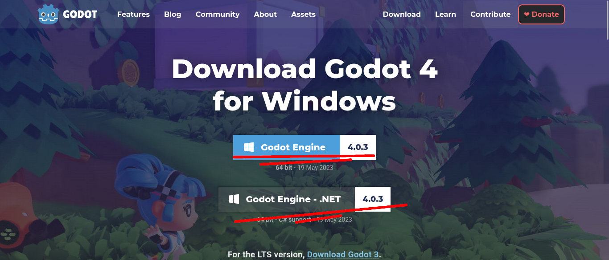

Cualquiera de los dos sirve para este tutorial, puesto que no usaremos C#. Usaremos gdscript.

Descarga el archivo assets.zip desde release. [https://github.com/kurinoku/bird-game-workshop-2023/releases/tag/assets](https://github.com/kurinoku/bird-game-workshop-2023/releases/tag/assets)

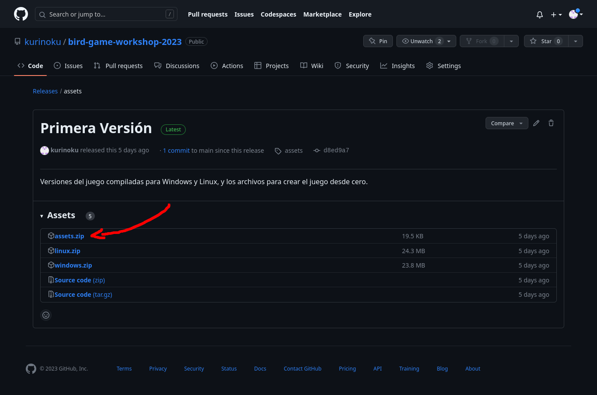

Abre la carpeta donde descargaste el archivo de godot. 

Descomprime el archivo comprimido y haz doble click en el ejecutable godot.
(Si descargaste la misma version, se debería llamar el ejecutable Godot_v4.0.3-stable_win64.exe)

## Abriendo Godot (Administrador de Proyectos)

Aparecerá esta pantalla.

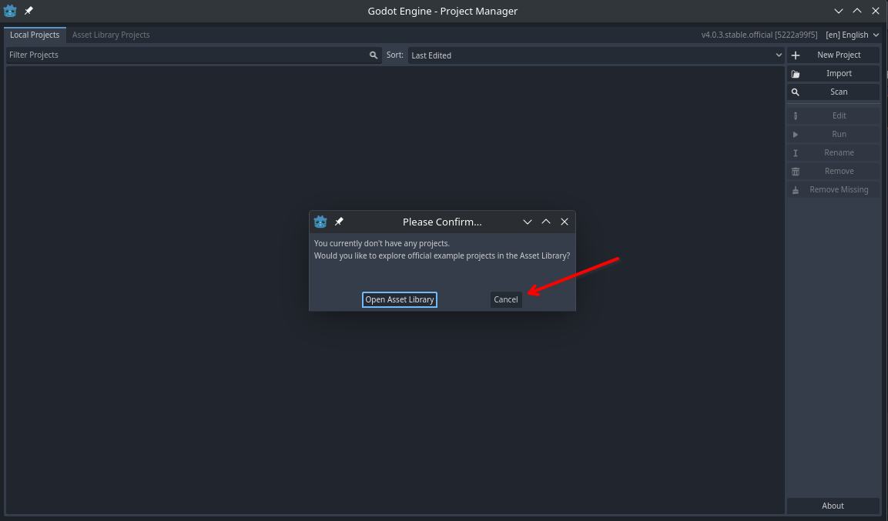

Presiona cancelar, el boton que debería salir en el lado derecho.

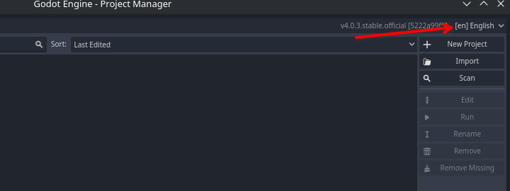

Asegurate que el idioma esté en [es] Spanish.

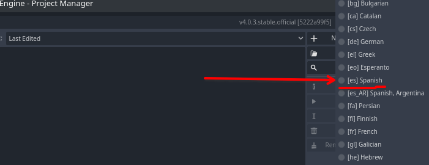

Presiona reiniciar el editor, para terminar de cambiar el idioma. Si esperas un segundo la ventana de godot debería aparecer de nuevo.

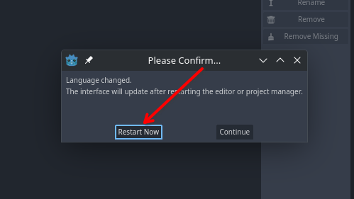

## Crear proyecto nuevo

Ahora podemos crear un nuevo proyecto.

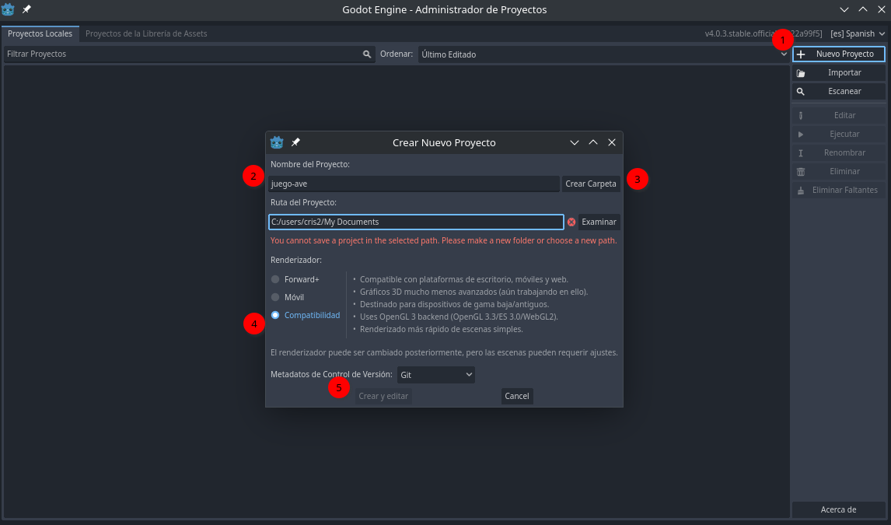

1. Presiona el boton de nuevo proyecto
2. Coloca un nombre al nuevo proyecto, usaremos "juego-ave".
3. Presiona el botón de Crear Carpeta, esto dejará todos los archivos de nuestro proyecto en una nueva carpeta
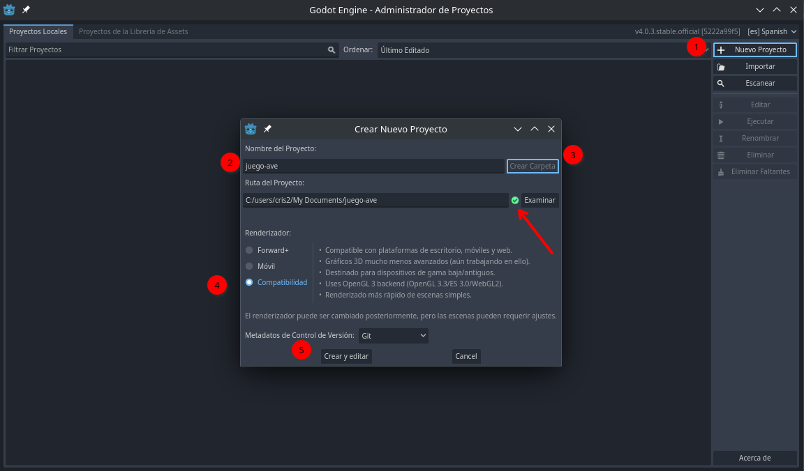
4. Seleccionaremos el renderizador de compatibilidad, esto nos permitirá exportar a una mayor cantidad de plataformas, y como el juego es simple, no tendremos mayores problemas de hacerlo.
5. Presionemos crear y editar.

## Estructurar proyecto

A continuación vamos a crear una carpeta assets para guardar los contenidos del archivo comprimido assets.zip descargado anteriormente.

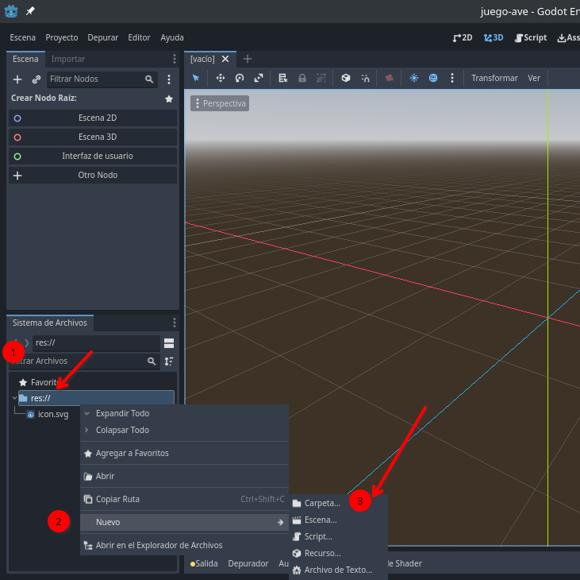

1. Dirigete a la sección de Sistema de Archivos
2. Presiona click derecho en res://
3. Dirigete al submenu Nuevo
4. Presiona Carpeta
   
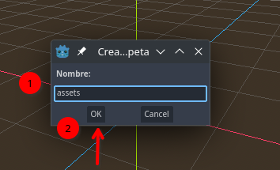
1. Escribe el nombre de la carpeta en el pop-up, assets.
2. Presiona OK.

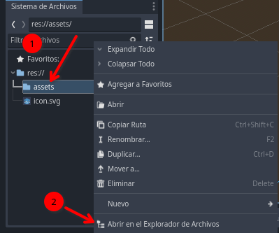
1. Presiona click derecho en assets
2. Click en Abrir en el Explorar de Archivos

Esto abrirá el explorador de archivos, descomprime assets.zip en esta carpeta.

Después de descomprimir, la carpeta de assets se debería ver así.

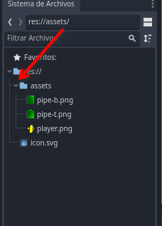

> Si no se ve, presiona la flecha que esta al lado derecho de assets, esto expandiría la vista de la carpeta. Si no está la flecha, es que la carpeta está vacía y falta un paso.

¿Cómo empezar? | Siguiente (En Desarrollo)
